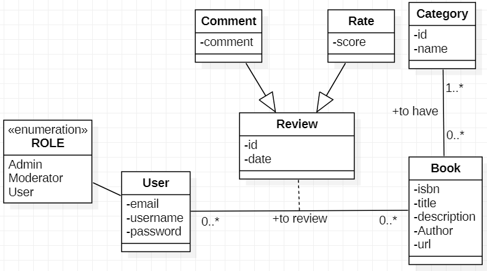

# MF Library

**Author:** ETOUNDI II Eugene  
**Email:** etoundisebastien@gmail.com  
**Location:** Lyon, France

Cloning the main repo with submodules

- `git clone --recurse-submodules https://github.com/eugene-seb/MF-Library.git`

*** 

## Project description

## Context

The **MF Library** project was born from the need to explore and apply **Spring Cloud** in a real-world microservices
architecture. The objective is to gain hands-on experience in **Spring Boot, Spring Cloud, and microservices deployment
**, while designing a **scalable and maintainable application**. By implementing industry’s best practices, this project
will serve as a practical learning experience in **distributed systems, API management, and cloud infrastructure**.

## Objective

The goal of **MF Library** is to create an **online platform** where users can access a vast collection of **free public
domain books**. The platform will allow users to:

- **Search, browse, and read books** available in the database.
- **Create an account** to personalize their experience.
- **Rate and review books** to provide community-driven recommendations.

This system should be **scalable, resilient, and easy to extend**, ensuring a seamless experience for users.

## Technical Description

### System Architecture

MF Library follows a **microservices architecture** using **Spring Cloud**, allowing independent services to communicate
efficiently while ensuring modularity.

#### **1. User Service**

- Handles authentication and user profile management.
- Manages roles and permissions for accessing different features.

#### **2. Book Service**

- Stores and retrieves book information (title, author, genre, etc.).
- Supports book categorization and metadata management.

#### **3. Review Service**

- Allows users to leave reviews and ratings for books.
- Connects user feedback to books for community engagement.

#### **4. API Gateway**

- A central entry point for routing requests to appropriate microservices.
- Manages authentication, rate-limiting, and request forwarding.

#### **5. Service Discovery & Configuration** *(Spring Cloud Eureka & Config Server)*

- Helps in dynamic service registration and automatic discovery.
- Manages centralized configuration for microservices.

### **Technologies & Tools**

- **Database**
    - **PostgreSQL** is the primary database engine chosen for its robustness and compatibility with Spring Boot.
    - Each microservice will have **its own database instance**.

- Docker & Kubernetes
- Cloud Hosting (AWS or Local Kubernetes Cluster)
- Spring Cloud Config & Eureka Server
- CI/CD Pipeline (GitHub Actions)

- **Security & API Management**
    - Spring Security + JWT/OAuth2
    - Rate-limiting in API Gateway
    - Role-Based Access Control (RBAC)

## UML Diagrams

- **Deployment Diagram**

- **Flow of a User Request**

- **Domain Class Diagram**

## References

- [Best Practices in Spring Boot Project Structure](https://medium.com/learnwithnk/best-practices-in-spring-boot-project-structure-layers-of-microservice-versioning-in-api-cadf62bd3459) |
  by Nadeem Khan (NK) | LearnWithNK | Medium
