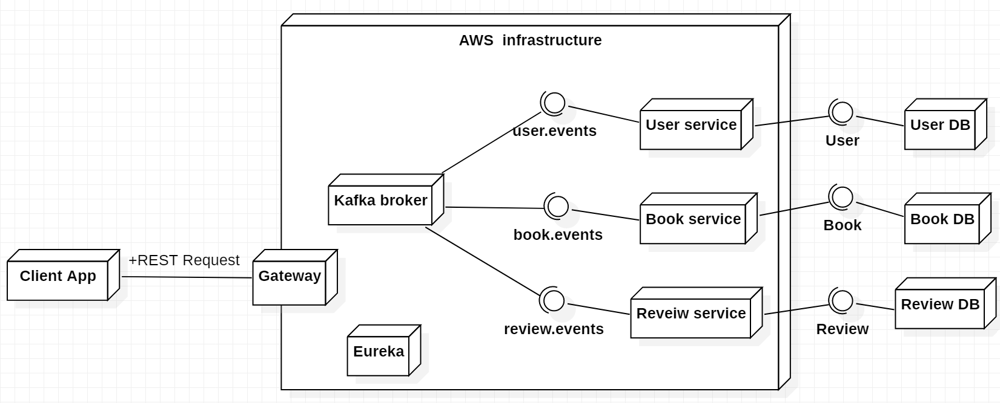

# MF Library

**Author:** ETOUNDI II Eugène  
**Email:** etoundisebastien@gmail.com  
**Location:** Lyon, France

> Your open platform to explore, access, and discuss free public‑domain and permissively licensed
> books. 📚
>
> Discover. Read. Review. Share knowledge.

---

## 🔥 Why MF Library?

MF Library aims to deliver a modern, scalable and secure platform where users can:

- 🔍 Search and browse a curated catalog of free books
- 📖 View rich book metadata and (future) embedded readers
- ⭐ Rate and review titles to guide others
- 🛡️ Benefit from a secure, token-based architecture
- 🚀 Experience a cloud-ready microservices foundation

---

## 🧭 Table of Contents

1. [Vision & Value Proposition](#-vision--value-proposition)
2. [Core Features](#-core-features)
3. [Architecture Overview](#-architecture-overview)
4. [Service Responsibilities](#-service-responsibilities)
5. [Technology Stack](#-technology-stack)
6. [Quick Start (5 Minutes)](#-quick-start-5-minutes)
7. [Running Locally (Detailed)](#-running-locally-detailed)
8. [Configuration & Environment](#-configuration--environment)
9. [Security Model](#-security-model)
10. [Domain & Use Cases](#-domain--use-cases)
11. [API Strategy](#-api-strategy)
12. [Messaging & Events](#-messaging--events)
13. [Data & Persistence](#-data--persistence)
14. [Testing Approach](#-testing-approach)
15. [Scalability & Performance](#-scalability--performance)
16. [Roadmap](#-roadmap)
17. [Diagrams](#-diagrams)
18. [Folder Map](#-folder-map)
19. [Development Workflow](#-development-workflow)
20. [Contributing](#-contributing)
21. [FAQ](#-faq)
22. [Glossary](#-glossary)
23. [License](#-license)
24. [Acknowledgements](#-acknowledgements)

---

## 🎯 Vision & Value Proposition

MF Library is engineered to be an extensible knowledge platform built on a robust microservice
foundation. Its design emphasizes:

- Separation of domains (users, books, reviews)
- Cloud and container readiness from day one
- Strong security and future observability
- Event-driven evolution with Kafka
- Developer friendliness and clarity

---

## ✅ Core Features

Current / Planned (MVP Scope):

| Feature                                 | Status | Notes                                                   |
|-----------------------------------------|:------:|---------------------------------------------------------|
| User authentication & accounts          |   🚧   | Keycloak realm import available; UI integration pending |
| Browse book catalog                     |   🚧   | Book service scaffold ready                             |
| Book search (title/author)              |   🚧   | Repository queries to implement                         |
| View book details + aggregated rating   |   🚧   | Rating aggregation design TBD                           |
| Submit & manage reviews                 |   🚧   | Review service base in place                            |
| API gateway routing & service discovery |   ✅    | Eureka + Gateway operational                            |
| Secured endpoints (JWT)                 |   🚧   | Resource server dependencies present                    |
| OpenAPI docs per service                |   🚧   | springdoc configured (expand aggregation)               |
| Event publication (Kafka)               |   🚧   | Topics & consumers definition pending                   |
| Responsive Angular SPA shell            |   ✅    | Frontend scaffold running                               |

Legend: ✅ = Implemented / working • 🚧 = In progress / scaffolded • 🧪 = Experimental • 🔮 = Planned

Future (Post-MVP): reading session, recommendation engine, collection curation, social signals.

---

## 🏗️ Architecture Overview

Pattern: Microservices + API Gateway + Service Discovery + External Identity Provider + Event
Backbone.

Core components:

- Gateway → single ingress, policy, routing
- Eureka → discovery registry
- Keycloak → authentication / OIDC provider
- Domain services → user, book, review verticals
- Kafka → asynchronous decoupling & future analytics pipeline
- PostgresSQL → relational persistence (per bounded context)
- Angular SPA → user-facing interface

Cross-cutting (implemented or planned): validation, OpenAPI docs, RBAC, future observability &
resilience.

<details><summary><strong>Planned Enhancements</strong></summary>
<ul>
<li>Config server for centralized external configuration</li>
<li>Distributed tracing via OpenTelemetry</li>
<li>Resilience4j for circuit breaking</li>
<li>Rate limiting (Bucket4j / Gateway filters)</li>
</ul>
</details>

---

## 🧩 Service Responsibilities

| Service           | Port                | Responsibility                          | Tech Highlights                    |
|-------------------|---------------------|-----------------------------------------|------------------------------------|
| Registry (Eureka) | 8761                | Dynamic service discovery               | Spring Cloud Netflix Eureka Server |
| API Gateway       | 8765                | Edge routing, security delegation, CORS | Spring Cloud Gateway               |
| User Service      | 8081                | User profiles & identity linkage        | Spring Boot, Security, JPA         |
| Book Service      | 8082                | Catalog, metadata, classification       | Spring Boot, JPA, OpenAPI          |
| Review Service    | 8083                | Ratings & textual reviews               | JPA, Kafka-ready, Feign (future)   |
| Keycloak          | 8085                | OIDC provider & token service           | Keycloak 24.x                      |
| Kafka + Zookeeper | 29092 / 9092 / 2181 | Event messaging backbone                | Confluent images                   |
| PostgreSQL        | 5432                | Relational persistence                  | Separate schemas (strategy)        |
| Frontend          | 4200 (dev)          | SPA UX                                  | Angular 19                         |

---

## 🛠️ Technology Stack

**Backend:** Java 21, Spring Boot 3.4.x, Spring Cloud 2024.x, Spring Security, Spring Data JPA,
Spring Kafka, OpenFeign, springdoc-openapi, Lombok

**Frontend:** Angular 19, TypeScript, (future: NgRx / Signals state management)

**Infrastructure:** Docker Compose, Keycloak, PostgresSQL 17-alpine, Kafka/Zookeeper, Git submodules

**Testing:** Spring Boot Test, H2, Kafka Test, Security Test, Reactor Test, (planned:
Test containers, Contract Tests)

**Planned Observability:** Micrometer + Prometheus, Grafana, OpenTelemetry, structured logging
pipeline.

---

## ⚡ Quick Start (5 Minutes)

Clone with submodules and launch the full stack:

```bash
git clone --recurse-submodules https://github.com/eugene-seb/MF-Library.git
cd MF-Library
docker compose up --build
```

Then visit:

- Eureka: http://localhost:8761
- Gateway (edge API): http://localhost:8765
- Keycloak: http://localhost:8085
- (Add Angular dev separately: see below)

Stop & clean:

```bash
docker compose down -v
```

---

## 🧪 Running Locally (Detailed)

Backend (example):

```bash
cd services/book-service
./mvnw spring-boot:run   # Windows: mvnw.cmd spring-boot:run
```

Frontend:

```bash
cd mflibrary-frontend
npm install
ng serve
# http://localhost:4200
```

Run tests:

```bash
./mvnw test
```

Update submodules:

```bash
git submodule update --init --recursive
```

---

## ⚙️ Configuration & Environment

Environment is largely scaffolded via `docker-compose.yml`.

Key runtime variables (compose-managed):

| Component       | Key Variables (non-exhaustive)                                                                |
|-----------------|-----------------------------------------------------------------------------------------------|
| Zookeeper       | `ZOOKEEPER_CLIENT_PORT`, `ZOOKEEPER_TICK_TIME`                                                |
| Kafka           | `KAFKA_BROKER_ID`, `KAFKA_ZOOKEEPER_CONNECT`, `KAFKA_LISTENERS`, `KAFKA_ADVERTISED_LISTENERS` |
| Keycloak        | `KEYCLOAK_ADMIN`, `KEYCLOAK_ADMIN_PASSWORD`                                                   |
| Postgres        | `POSTGRES_USER`, `POSTGRES_PASSWORD`                                                          |
| Spring Services | `SPRING_PROFILES_ACTIVE=docker`                                                               |

Suggested future `.env` (example placeholder):

```
POSTGRES_USER=postgres
POSTGRES_PASSWORD=postgres
KEYCLOAK_ADMIN=admin
KEYCLOAK_ADMIN_PASSWORD=admin
SPRING_PROFILES_ACTIVE=local
```

Keycloak realm import JSON files (mounted):

- `.infra/keycloak/app-mflibrary-realm-export.json`
- `.infra/keycloak/master-realm-export.json`

---

## 🔐 Security Model

- Identity via Keycloak (OIDC): Users authenticate in the browser → tokens passed to backend
- Resource services validate JWT (Spring Security + OAuth2 Resource Server)
- Planned roles: `ROLE_USER`, `ROLE_ADMIN`
- Future: Fine-grained scopes (e.g. `books.read`, `reviews.write`), audit events, rate limiting

Auth Flow (simplified):
User → Browser SPA → Keycloak Login → Receives ID + Access Token → Calls Gateway → Gateway forwards
with token → Resource service validates & authorizes

---

## 📘 Domain & Use Cases

Actors: Visitor, Registered User, Administrator.

Primary Flows:

1. Browse Catalog → list books with pagination & filters
2. Book Detail → fetch metadata + aggregated rating
3. Register/Login → delegated to Keycloak (redirect flow)
4. Submit Review → authenticated user posts rating/comment
5. Moderate Reviews (admin) → approve/remove

Planned Event Flow (future):
ReviewCreated → Kafka topic → Aggregator updates rating snapshot.

---

## 🧩 API Strategy

Design Principles:

- Versioned base path: `/api/v1/*`
- Resource-oriented endpoints
- Consistent error contract (planned):

```json
{
  "timestamp": "2025-01-01T12:00:00Z",
  "path": "/api/v1/books/123",
  "error": "NOT_FOUND",
  "message": "Book not found",
  "requestId": "<trace-id>"
}
```

- OpenAPI auto-generation (per-service) at `/v3/api-docs` & `/swagger-ui.html`
- Future aggregation via API gateway or dedicated API portal

---

## 📡 Messaging & Events

Kafka infrastructure is prepared. Topic candidates:

| Topic             | Purpose                                       | Status |
|-------------------|-----------------------------------------------|:------:|
| `reviews.created` | Trigger rating aggregation / analytics        |   🔮   |
| `reviews.updated` | Recompute rating delta                        |   🔮   |
| `books.activity`  | Track popular titles / future recommendations |   🔮   |

Legend: 🔮 = Planned • 🚧 = In Progress • ✅ = Active

Future: schema evolution management (Avro/Protobuf + Schema Registry), consumer groups for
analytics.

---

## 🗄️ Data & Persistence

- PostgresSQL as primary store (one DB per service or schema-based isolation strategy)
- JPA/Hibernate with migration tooling (Liquibase/Flyway planned)
- H2 for test isolation
- Future: caching layer (Redis) for book metadata & aggregated ratings

---

## 🧪 Testing Approach

| Layer       | Current                                 | Planned                                 |
|-------------|-----------------------------------------|-----------------------------------------|
| Unit        | Spring Boot Test                        | More domain-only tests                  |
| Integration | H2 + MockMVC + embedded Kafka test libs | Test-containers-based infra replication |
| Contract    | —                                       | Spring Cloud Contract                   |
| E2E         | —                                       | Postman/Cypress pipeline                |
| Performance | —                                       | Gatling / k6 benchmarks                 |

---

## 🚀 Scalability & Performance

Prepared Strategies:

- Stateless services → horizontal scaling
- Independent deployability → reduced blast radius
- Event-driven async operations (Kafka) to decouple heavy workflows
- Gateway filtering for rate limiting (planned)
- Observability for capacity planning (metrics/tracing planned)

Future: CDN for static assets, query optimization, caching, read replicas.

---

## 🗺️ Roadmap

Short-Term:

- Book search endpoints
- Review submission + retrieval
- OAuth2 flow integration on frontend
- Standard error model & gateway filters

Mid-Term:

- Kafka event flows (rating aggregation)
- Observability stack & tracing
- Admin web module
- Config server adoption

Long-Term:

- Recommendation engine
- Ingestion pipeline (EPUB/PDF parsing)
- Multi-language support
- Kubernetes deployment & autoscaling

---

## 🖼️ Diagrams

| Diagram                                | File                                  |
|----------------------------------------|---------------------------------------|
| Deployment                             | `doc/images/Deployment-Diagram.png`   |
| User Request Flow                      | `doc/images/Flow-user-request.png`    |
| Domain Model                           | `doc/images/Domain-class-diagram.png` |
| Components                             | `doc/images/Components-diagram.png`   |
| Sequence (Review Submit - Placeholder) | (Add)                                 |
| API Interaction Map (Placeholder)      | (Add)                                 |

Inline Samples:



> TODO: Add a sequence diagram for Review creation lifecycle.

---

## 📂 Folder Map

| Path                  | Purpose                                |
|-----------------------|----------------------------------------|
| `docker-compose.yml`  | Orchestrates infra + services          |
| `services/`           | Active microservice implementations    |
| `submodules/`         | Mirrored submodule repositories        |
| `mflibrary-frontend/` | Angular SPA project                    |
| `doc/images/`         | Architecture & UML diagrams            |
| `.infra/keycloak/`    | Realm import JSON (mounted in compose) |
| `README.md`           | This documentation                     |
| `TODO.md`             | Internal task notes                    |

---

## 🔁 Development Workflow

1. Branch: `feat/<topic>` or `fix/<issue>`
2. Implement + add/update tests
3. Validate locally (`./mvnw test` + manual service run)
4. Commit atomic changes; reference issues when applicable
5. Open PR for review (future CI automation)
6. Merge → prepare container publish (future pipeline)

---

## 🤝 Contributing

External contribution guidelines will be formalized. For now:

- Use conventional commit style if possible (e.g. `feat: add search endpoint`)
- Keep PRs focused & small
- Document architectural-impacting changes
- Prefer adding tests with new features

Planned docs: `CONTRIBUTING.md`, `CODE_OF_CONDUCT.md`, `SECURITY.md`.

---

## ❓ FAQ

**Q: Can I add proprietary books?**  
A: Only if licensing permits. Default positioning is public-domain / permissively licensed content.

**Q: Where do I configure Keycloak realms?**  
A: See `.infra/keycloak/*.json` imported at container startup.

**Q: How do I reset Postgres data?**  
A: `docker compose down -v` removes volumes (all data lost). Use with caution.

**Q: Does the gateway aggregate OpenAPI yet?**  
A: Not yet—planned in roadmap.

**Q: Is horizontal scaling supported?**  
A: Architecture enables it; orchestration (Kubernetes) is a future milestone.

---

## 📘 Glossary

| Term            | Meaning                                                    |
|-----------------|------------------------------------------------------------|
| Bounded Context | Independently modeled domain service (DDD principle)       |
| Resource Server | OAuth2-protected API validating JWT tokens                 |
| Gateway         | Edge service handling routing and cross-cutting concerns   |
| Realm           | Keycloak logical tenant boundary for users, roles, clients |
| Event           | Asynchronous message published to Kafka topic              |

---

## 📄 License

This project is licensed under the [MIT License](LICENSE.txt).

---

## 🙏 Acknowledgements

- Open Source frameworks powering the platform
- Community patterns for microservice design & security
- Inspiration: public knowledge & digital library initiatives

---

## 📬 Feedback

Have an idea or found an issue? Open an issue or start a discussion.

> "Access to knowledge empowers everyone. Let's build it right." 🌍
